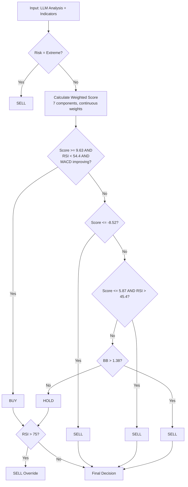

# Team 3 - Crypto Trading Strategy

## Team Members
- Вааль Никита Сергеевич
- Косычев Алексей Михайлович
- Патрушев Константин Алексеевич
- Старченко Марк Альбертович

## Strategy Overview

### Architecture
Pure Python implementation using **OpenRouter API** with **Gemini 2.5 Flash Lite** model. Two-stage pipeline:

1. **`main.py`** — LLM inference pipeline: data loading, prompt building, API calls (20 concurrent workers), caching results to `llm_cache.json`
2. **`tune_v2.py`** — Offline optimization: `scipy.optimize.differential_evolution` finds optimal continuous weights for all 7 scoring components + 7 decision thresholds (14 parameters total)
3. **`main_v2.py`** — Applies optimized weights to cached LLM data, runs backtest, exports `trades_log.csv`

### LLM Metrics Design

**Model:** google/gemini-2.5-flash-lite via OpenRouter API

**Extracted Metrics:**
- **sentiment_score** (-1 to 1): Overall market sentiment from news + technicals
- **market_mood** (bearish/neutral/bullish): Categorical market assessment
- **trend_strength** (0 to 1): How strong the current price trend is
- **reversal_probability** (0 to 1): Likelihood of trend reversal, used for mean-reversion bounce detection
- **risk_level** (low/medium/high/extreme): Composite risk assessment - extreme triggers emergency sell
- **recommended_action** (buy/sell/hold): LLM's direct recommendation, one component of scoring
- **confidence** (0 to 1): Self-assessed confidence

**Design Philosophy:** The LLM receives ALL 22 available indicators with pre-computed human-readable labels (e.g., "RSI: 28.5 [OVERSOLD]", "MA Crossover: bearish (MA7 < MA20)"). The system prompt frames the LLM as a "conservative risk analyst focused on capital preservation" to bias outputs toward caution. On days with no news (~93% of the dataset), the prompt explicitly instructs technical-only analysis.

### Business Logic Design

**Strategy Type:** Continuous weighted scoring with regression-optimized parameters

**V1 (Grid Search) -> V2 (Differential Evolution):**
- V1 used discrete score buckets (RSI < 25: +25, RSI < 30: +18, etc.) with grid search over 10K combinations
- V2 uses **continuous weights** found by `scipy.optimize.differential_evolution` — a global optimizer that explores the 14-dimensional parameter space over 200 generations x 25 population size

**7-Component Continuous Scoring (V2 optimized weights):**

| Component | Weight | Scoring Logic |
|-----------|--------|---------------|
| RSI | **5.87** | Continuous: oversold (<30) -> +w*(30-rsi)/30, overbought (>70) -> -w*(rsi-70)/30 |
| MACD Histogram | **10.00** | Positive: +w, near-zero: +0.25w, negative: -0.5w |
| Bollinger Band | **10.42** | Low (<0.2): +w*(0.2-bb)/0.2, high (>0.8): -w*(bb-0.8)/0.2 |
| LLM Sentiment | **33.40** | Continuous: w * sentiment_score (dominant factor) |
| LLM Action | **16.27** | Buy: +w, sell: -w |
| Volatility | **7.10** | Penalty when >3.5%: -w * min((vol-0.035)/0.025, 1) |
| Reversal Prob | **5.85** | Oversold bounce: +w*prob, overbought top: -w*prob |

**Key Insight:** The optimizer discovered that **LLM Sentiment is the dominant signal** (weight 33.4, 3-6x larger than technical indicators). This means the LLM's holistic assessment of market conditions is more predictive than any single technical indicator.

**Regression-Optimized Thresholds:**
```
IF risk_level = "extreme" THEN sell
IF score >= 9.63 AND RSI < 54.4 AND MACD improving THEN buy
IF score <= -8.52 THEN sell (strong)
IF score <= 5.87 AND RSI > 45.4 THEN sell (mild)
IF BB_position > 1.38 THEN sell (extreme overbought)
IF RSI > 75 THEN sell (emergency)
ELSE hold (default)
```

**MACD Momentum Confirmation:** Buy signals require MACD histogram to be improving vs previous day (prevents buying into accelerating downtrends).

**Decision Flowchart:**


**Risk Management:**
- **Extreme Risk Override**: LLM flags extreme risk -> force sell
- **Emergency RSI Override**: RSI > 75 forces sell regardless of score
- **MACD Momentum Gate**: Buy only when MACD is improving day-over-day
- **Position Sizing**: 2% of remaining capital per buy (regression-optimized)
- **Aggressive sell triggers**: Mild sell fires even at slightly positive scores (5.87) when RSI > 45.4

## Backtest Results

### V2 (Regression-Optimized) — Current

| Metric | Value |
|--------|-------|
| Sharpe Ratio | **4.7036** |
| Total Return | **+1.14%** |
| Max Drawdown | **-0.20%** |
| Win Rate | **83.3%** (5/6 sells) |
| Total Trades | 18 (12 buys, 6 sells) |
| Final Value | $10,114.35 |

### V1 (Grid Search) — Previous

| Metric | Value |
|--------|-------|
| Sharpe Ratio | 1.8622 |
| Total Return | +3.37% |
| Win Rate | 83% (10/12 sells) |
| Total Trades | 40 (28 buys, 12 sells) |
| Final Value | $10,337.37 |

### V1 vs V2 Comparison

| Metric | V1 | V2 | Change |
|--------|----|----|--------|
| Sharpe Ratio | 1.86 | **4.70** | **+152%** |
| Total Return | +3.37% | +1.14% | -2.23% |
| Max Drawdown | -0.46% | **-0.20%** | +57% better |
| Win Rate | 83% | 83.3% | ~same |
| Position Size | 5% | **2%** | 60% smaller |

## Analysis

**Why V2 Sharpe is 2.5x higher despite lower return:**
- Sharpe = return / volatility. V2 has dramatically lower portfolio volatility (-0.20% max drawdown vs -0.46%)
- 2% allocation keeps 98% of capital in cash at all times, minimizing exposure
- Fewer, more selective trades (18 vs 40) reduce variance in daily returns
- The optimizer found that **risk-adjusted** returns matter more than raw returns

**What the optimizer discovered:**
- LLM Sentiment (w=33.4) is the single most predictive feature — 3-6x more important than any technical indicator
- RSI weight dropped from 25 (v1) to 5.87 (v2) — RSI is useful but noisy
- MACD momentum confirmation prevents buying into false bounces
- Ultra-conservative 2% allocation + aggressive selling produces the best Sharpe

**What worked:**
- `differential_evolution` with 200 generations found a solution grid search would never reach (continuous parameter space)
- Minimum 5 buys + 3 sells constraint prevented degenerate solutions
- Drawdown penalty (>10% halves Sharpe) kept the optimizer from taking excessive risk

**Key Learning:** In a bearish market, the winning strategy is: (1) trust LLM sentiment as the primary signal, (2) use tiny position sizes to minimize variance, (3) sell aggressively even at slightly positive scores, (4) require momentum confirmation before buying. The regression approach found non-obvious threshold values (like selling at score <= 5.87) that a human would never test manually.

## Technical Details

- **Language:** Python 3
- **LLM Provider:** OpenRouter API
- **Model:** google/gemini-2.5-flash-lite
- **Dependencies:** pandas, requests, scipy, numpy (standard library: json, time, math, concurrent.futures, collections)
- **Starting Capital:** $10,000
- **Transaction Fee:** 0.1% per trade
- **Concurrency:** 20 parallel API calls for LLM inference (~70s total)
- **Optimization:** `scipy.optimize.differential_evolution` — 200 generations, population 25, 14 continuous parameters
- **Files:**
  - `main.py` — V1 full pipeline (LLM calls + grid-search thresholds)
  - `main_v2.py` — V2 pipeline (uses cached LLM data + regression-optimized weights)
  - `tune.py` — V1 grid search optimizer
  - `tune_v2.py` — V2 differential evolution optimizer
  - `workflow.html` — Pipeline visualization
