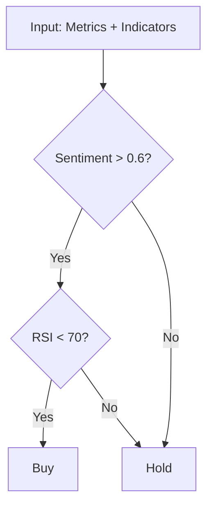

# Crypto Trading AI Bot - 2.5-Hour Team Competition

## 📋 Overview

**Mission:** Design a trading strategy by customizing two components:
1. **LLM Prompt** - What metrics to extract from news?
2. **Business Logic** - How to combine signals into trading decisions?

**Pre-built:** n8n workflow, data pipeline, backtesting engine  
**Your Task:** Modify 2 nodes + document strategy in GitHub

**Evaluation:** Ranked by Sharpe Ratio (risk-adjusted return)
- Top 30% → 3 points
- Middle 40% → 2 points  
- Bottom 30% → 0-1 points

---

## ⏱️ Schedule

| Time | Activity |
|------|----------|
| 18:00-18:15 | MCP Concepts |
| 18:15-18:30 | n8n Workflow Walkthrough |
| **18:30-21:00** | **Competition (2.5 hours)** |
| **21:00** | **Submit GitHub Link** |
| 21:05 | Live Ranking Reveal 🏆 |

---

## 📊 Dataset

### crypto_features_3months.csv
90 days × 10 coins (BTC, ETH, BNB, XRP, SOL, ADA, DOGE, DOT, LTC, MATIC)

**Technical Indicators (pre-calculated):**
- Price: `open`, `high`, `low`, `close`, `volume`
- Returns: `returns`, `volatility_7d`
- Moving Averages: `ma7`, `ma20`, `ma50`
- Bollinger Bands: `bb_upper`, `bb_lower`, `bb_position`
- Momentum: `rsi`, `macd`, `macd_signal`, `macd_hist`
- Volume: `volume_change`, `obv`
- News: `news_count`

### crypto_news_3months.csv
Columns: `date`, `title`, `body`, `url`, `source`

---

## 🎯 Your Tasks

### Task 1: Design LLM Metrics (Node: "Extract Metrics")

**Default Prompt (provided):**
```
Analyze news and output JSON:
{
  "sentiment_score": float (-1 to 1),
  "market_mood": "bullish" | "bearish" | "neutral",
  "recommended_action": "buy" | "sell" | "hold"
}
```

**Customization Ideas:**

Add domain-specific metrics:
```json
{
  "sentiment_score": 0.72,
  "regulatory_risk": 0.2,
  "adoption_signal": 0.8,
  "whale_activity": "high",
  "key_events": ["ETF_approval"],
  "confidence": 0.85
}
```

Or multi-coin analysis:
```json
{
  "BTC": {"sentiment": 0.6, "momentum": "strong"},
  "ETH": {"sentiment": 0.8, "momentum": "weak"}
}
```

### Task 2: Implement Trading Logic (Node: "Trading Logic")

**Default Logic (provided):**
```javascript
const sentiment = analysis.sentiment_score;
const rsi = indicators.rsi;

let decision = "hold";
if (sentiment > 0.5 && rsi < 70) decision = "buy";
else if (sentiment < -0.3 || rsi > 75) decision = "sell";

return [{ json: { decision, coin: indicators.ticker }}];
```

**Customization Examples:**

Scoring system:
```javascript
let score = sentiment * 50 + (70 - rsi) * 0.5 + (macd_hist > 0 ? 20 : -20);
if (score > 60) decision = "buy";
else if (score < -30) decision = "sell";
```

Multi-signal ensemble:
```javascript
const votes = {
  llm: analysis.recommended_action,
  rsi: rsi < 30 ? "buy" : rsi > 70 ? "sell" : "hold",
  macd: macd > macd_signal ? "buy" : "sell"
};
// Majority vote logic here
```

Risk management:
```javascript
if (rsi > 85) decision = "sell"; // Emergency stop-loss
if (volatility_7d > 0.05) decision = "hold"; // Avoid high volatility
```

---

## 📝 Submission

### Submit GitHub Repository Link

**Deadline:** 21:00 (submit link via [Google Form / LMS / Spreadsheet])

**Your repository must contain:**

```
team-XX-crypto-bot/
├── README.md              ← Your strategy documentation
├── workflow.json          ← Exported n8n workflow
└── trades_log.csv         ← Backtest results
```

---

## 📄 README.md Template

```markdown
# Team XX - Crypto Trading Strategy

## Team Members
- [Name] - [Student ID]
- [Name] - [Student ID]
- [Name] - [Student ID]
- [Name] - [Student ID]

## Strategy Overview

### LLM Metrics Design
**Extracted Metrics:**
- **[Metric 1]**: [Why we chose this]
- **[Metric 2]**: [Why we chose this]
- **[Metric 3]**: [Why we chose this]

**Design Philosophy:** [2-3 sentences explaining your approach]

### Business Logic Design

**Strategy Type:** [Rule-based / Scoring / Ensemble / Hybrid]

**Core Decision Rules:**
```
IF [condition 1] THEN buy
IF [condition 2] THEN sell
IF [condition 3] THEN hold
```

**Decision Flowchart:**


**Risk Management:**
- Max position size: [X%]
- Stop-loss condition: [Condition]
- Trade frequency limit: [Max X trades/day]

## Backtest Results

| Metric | Value |
|--------|-------|
| **Sharpe Ratio** | **X.XX** |
| Total Return | +X.X% |
| Max Drawdown | -X.X% |
| Win Rate | XX% |
| Total Trades | XX |

### Analysis
**What worked:**
- [Insight 1]
- [Insight 2]

**What didn't work:**
- [Challenge 1]
- [Challenge 2]

**Key Learning:**
[1-2 sentences]
```

---

## 🏆 Evaluation

**Sharpe Ratio Formula:**

$$\text{Sharpe Ratio} = \frac{\text{Avg Daily Return}}{\text{Std Dev of Returns}} \times \sqrt{365}$$

**What it measures:** Risk-adjusted return (higher = better)

**Example:**
- Strategy A: +50% return, 5% volatility → Sharpe = 10.0 ✅
- Strategy B: +100% return, 60% volatility → Sharpe = 1.67 ❌

**Ranking Process:**
1. Instructor clones all repositories at 21:00
2. Runs `workflow.json` on same dataset
3. Calculates Sharpe Ratio from `trades_log.csv`
4. Ranks teams and announces results

**Tie-breakers:** Lower drawdown → Higher return

**Disqualification (0 pts):**
- Repository link not submitted by 21:00
- Missing README.md
- No modifications to workflow
- Plagiarized code

---

## 💡 2.5-Hour Plan

**18:30-18:45 (15min) - Setup**
- Fork starter repository
- Run default workflow
- Check baseline Sharpe Ratio

**18:45-19:00 (15min) - Brainstorm**
- What news signals matter?
- Risk-averse or aggressive?
- Divide tasks (2 on prompt, 2 on logic)

**19:00-20:00 (60min) - Build & Test**
- Modify nodes
- Run backtest → iterate
- Sync at 19:30

**20:00-20:30 (30min) - Optimize**
- Fine-tune parameters
- Test edge cases
- Final backtest

**20:30-20:50 (20min) - Document**
- Write README.md
- Create flowchart
- Export files

**20:50-21:00 (10min) - Submit**
- Push to GitHub
- Submit repository link

---

## 🚨 Rules

**Allowed:**
- Modify the 2 designated nodes only
- Use all provided indicators
- Test multiple approaches
- Discuss ideas with other teams

**Prohibited:**
- External data sources
- Modifying other nodes in workflow
- Plagiarism (code similarity check)
- Hard-coded date-specific rules
- Late submission

---

## 💡 Tips

**For High Sharpe Ratio:**
1. **Prevent large losses** (stop-loss rules)
2. **Reduce volatility** (fewer trades)
3. **Scale positions** (use confidence scores)

**Common Mistakes:**
- Asking LLM to make final decision
- Too many metrics (>7)
- No risk management
- Overfitting to specific events

**Quick Sanity Check:**
- Baseline Sharpe should be ~0.5-1.0
- Negative Sharpe? Logic is broken
- Sharpe > 3.0? Check for overfitting

---

## ❓ FAQ

**Q: Can we make our repository private?**  
A: No. Must be public for instructor to access.

**Q: What if we push after 21:00?**  
A: Only commits before 21:00 will be evaluated.

**Q: Can we add more files to the repo?**  
A: Yes, but only README.md, workflow.json, and trades_log.csv are required.

**Q: What if LLM is slow during testing?**  
A: Use dummy JSON for faster iteration.

**Q: Starting capital?**  
A: $10,000. Transaction fee: 0.1% per trade.

---

## 📚 Resources

- [Mermaid Live Editor](https://mermaid.live/)
- [RSI Explained](https://www.investopedia.com/terms/r/rsi.asp)
- [Sharpe Ratio](https://www.investopedia.com/terms/s/sharperatio.asp)
- [n8n Documentation](https://docs.n8n.io/)
- [GitHub Markdown Guide](https://guides.github.com/features/mastering-markdown/)

---

**Best strategy wins. Submit GitHub link by 21:00. Good luck! 🚀**
